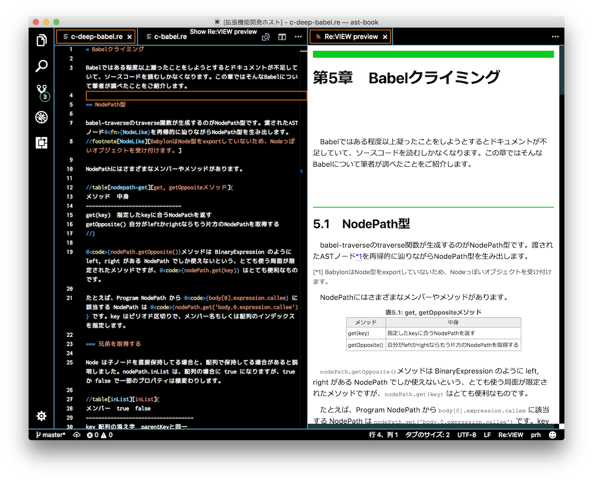

# Yet Another VSCode language Re:VIEW

This extension allows you to preview your [Re:VIEW](https://github.com/kmuto/review) markup language.

# Features

* Live preview
* Syntax highlighting



# Motivation

Enhanced format compatibility with original Re:VIEW.

# Install

```sh
$ ext install ya-language-review
```

## Windows

If you run it on Windows, you need to run Windows Native Ruby which is not WSL(Windows Subsystem for Linux). It is easy to install Ruby using the [RubyInstaller for Windows](https://rubyinstaller.org/).

```
A:\> rubyinstaller-2.x.x-x-x64.exe /verysilent /lang=ja /tasks="assocfiles,modpath"
```

Restart cmd.exe.

```
A:\> gem install review
```

# Donation

BTC: 1BRCrrHj46RgtszSp83pUdAMF5TpuZgghm
Monacoin: MUgG6ZC1DqiRSYgKW7vr8FtVL7eYHagdoL
BitZeny: Zm82eeF7XrqY2pj9AdBBTKryWT6GUZNHgy

# License

This software is MIT License (see [LICENSE.md](LICENSE.md))

* syntaxes/review.tmLanguage is taken from [yanzm/ReVIEW](https://github.com/yanzm/ReVIEW), Apache License Version 2.0
